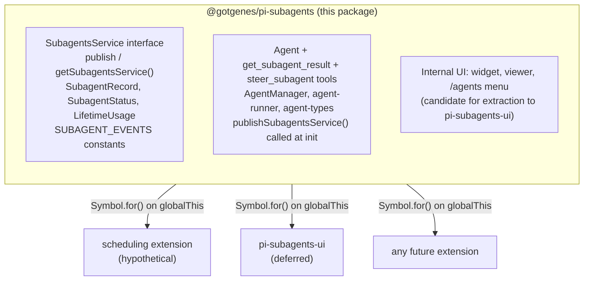

# Architecture

This document describes the architecture of the pi-subagents fork: a focused, composable core with a stable API boundary that other extensions can build on.

## Design principles

1. **Narrow core** — the extension owns agent spawning, execution, and result retrieval.
   Everything else is a consumer.
2. **Composable by default** — other extensions can spawn agents, observe their lifecycle, and display their state without importing this package directly.
3. **Typed API boundary** — this package exports a `SubagentsService` interface and `Symbol.for()` accessors (`publishSubagentsService` / `getSubagentsService`).
   Consumers declare this package as an optional peer dependency and use dynamic import for compile-time types.
   The runtime bridge is `Symbol.for("@gotgenes/pi-subagents:service")` on `globalThis` — no separate API package.
4. **No scheduling** — in-process scheduling is removed from the core.
   Scheduling is a separate concern that any extension can implement by calling `spawn()` on the published API.
5. **UI extraction is deferred** — the widget, conversation viewer, and `/agents` command menu stay in the core for now.
   They are the first candidate for extraction once the API boundary is proven stable.
6. **Snapshot, don't capture** — mutable parent state (ctx, session, model) is read once at spawn time and frozen into a `ParentSnapshot` data object.
   No live references survive past the spawn call.
7. **Subscribe, don't thread** — observation of agent progress uses direct session-event subscription, not callback parameters threaded through multiple layers.

## Current state

The extension is organized into 39 focused modules with a typed `SubagentsService` API boundary.

```text
index.ts                  — entry point, tool registration, event wiring
agent-manager.ts          — lifecycle, concurrency, queue
agent-runner.ts           — session creation, turn loop, tool filtering
session-config.ts         — pure session-config assembler
agent-types.ts            — type registry (defaults + custom .md files)
agent-record.ts           — agent record with encapsulated status transitions
types.ts                  — shared type definitions
runtime.ts                — SubagentRuntime factory (session-scoped state)
parent-snapshot.ts        — immutable snapshot of parent session state

prompts.ts                — system prompt assembly
context.ts                — parent conversation extraction
memory.ts                 — persistent MEMORY.md per agent
skill-loader.ts           — preload .pi/skills into prompts
env.ts                    — git/platform detection

worktree.ts               — git worktree isolation
usage.ts                  — token usage tracking
model-resolver.ts         — fuzzy model name resolution
invocation-config.ts      — merge tool params with agent config
session-dir.ts            — subagent session directory derivation
settings.ts               — persistent operational settings

service.ts                — SubagentsService interface + Symbol.for() accessors
service-adapter.ts        — SubagentsService implementation wrapping AgentManager

tools/agent-tool.ts       — Agent tool definition + execute
tools/get-result-tool.ts  — get_subagent_result tool
tools/steer-tool.ts       — steer_subagent tool
tools/helpers.ts          — shared tool utilities

handlers/lifecycle.ts     — session_start, session_before_switch, session_shutdown
handlers/tool-start.ts    — tool_execution_start handler

notification.ts           — completion nudges, custom message renderer
renderer.ts               — notification TUI component
record-observer.ts        — session-event observer for record statistics

ui/agent-widget.ts        — above-editor live status widget
ui/agent-menu.ts          — /agents slash command menu
ui/conversation-viewer.ts — scrollable session overlay
ui/ui-observer.ts         — session-event observer for UI streaming

default-agents.ts         — embedded default agent configs (general-purpose, Explore, Plan)
custom-agents.ts          — user-defined agent .md file loader
debug.ts                  — debug logging utility
```

### Observation model

Record statistics (tool uses, token usage, compaction counts) are updated by `record-observer.ts`, which subscribes directly to session events.
UI streaming (active tools, response text, turn counts) is handled by `ui/ui-observer.ts`, which subscribes to the same session events independently.
Neither observer wraps or forwards the other — both subscribe directly to the session.

The widget reads agent state by polling a shared `Map<string, AgentActivity>` on `SubagentRuntime` every 80 ms. The conversation viewer subscribes directly to `AgentSession` objects.

Cross-extension consumers use the typed `SubagentsService` API published via `Symbol.for("@gotgenes/pi-subagents:service")` on `globalThis`.

## Cross-extension architecture



Consumers call `getSubagentsService()?.spawn(...)` at runtime.
They declare this package as an optional peer dependency and use dynamic import for compile-time types.

### What the core owns

- The three tools: `Agent`, `get_subagent_result`, `steer_subagent`.
- `AgentManager` — spawn, queue, abort, resume, concurrency control.
- `agent-runner` — session creation, turn loop, tool filtering, extension binding (Patches 2 and 3).
- `session-config` — pure configuration assembler (extracted from `agent-runner`).
- `SubagentRuntime` — session-scoped state bag with methods.
- `ParentSnapshot` — immutable snapshot of parent session state, captured once at spawn time.
- `record-observer` — session-event observer that updates record statistics without callback threading.
- Agent type registry — default agents, custom `.md` file loading.
- Prompt assembly, context extraction, memory, skills, environment.
- Worktree isolation.
- Token usage tracking.
- Session directory derivation and persisted `SessionManager` for subagent transcripts.
- Settings persistence.
- Internal UI (widget, conversation viewer, `/agents` menu) — these stay until the API boundary is proven, then move to a separate extension.

### What the core dropped

- **Scheduling** (`schedule.ts`, `schedule-store.ts`, `ui/schedule-menu.ts`) — removed (#52).
  Any extension that wants scheduling can implement it by calling `getSubagentsService()?.spawn(...)` on a timer.
- **Ad-hoc RPC** (`cross-extension-rpc.ts`) — replaced by the typed `SubagentsService` published via `Symbol.for()` (#49).
- **Group join** (`group-join.ts`) — removed (#49).
  Individual completion notifications are sufficient.
- **Output file** (`output-file.ts`) — replaced by `session-dir.ts` + `SessionManager.create()` (#61).
  Subagent transcripts are now written in Pi's official JSONL session format.
- **Callback threading** — the three-layer `on*` callback chain through `SpawnOptions` → `AgentManager` → `RunOptions` was replaced by direct session-event subscriptions (#100).
- **Live `ctx` capture** — `SpawnArgs` previously held a mutable `ctx: ExtensionContext` reference that could go stale in the concurrency queue.
  Replaced by `ParentSnapshot`, an immutable data object captured once at spawn time (#99).

## SubagentsService

The `SubagentsService` interface, accessor functions, and serializable types are exported from `@gotgenes/pi-subagents` via the `./service` export map entry.
No separate API package is needed.

Consumers declare this package as an optional peer dependency:

```json
{
  "peerDependencies": {
    "@gotgenes/pi-subagents": ">=5.0.0"
  },
  "peerDependenciesMeta": {
    "@gotgenes/pi-subagents": { "optional": true }
  }
}
```

At runtime, consumers use dynamic import for type-safe access to the accessor functions:

```typescript
const { getSubagentsService } = await import("@gotgenes/pi-subagents");
const svc = getSubagentsService();
if (svc) {
  svc.spawn("Explore", "Check for stale TODOs");
}
```

Pi's extension loader creates a fresh `jiti` instance per extension with `moduleCache: false`, so module-scoped singletons don't survive across extensions.
The accessor functions use `Symbol.for("@gotgenes/pi-subagents:service")` on `globalThis`, which is process-global by spec, to bridge this gap.
The dynamic import provides compile-time types; the `Symbol.for()` key is the actual runtime channel.

### Interface

See `src/service.ts` for the canonical definition.
Key types:

- `SubagentsService` — `spawn`, `getRecord`, `listAgents`, `abort`, `steer`, `waitForAll`, `hasRunning`.
- `SubagentRecord` — serializable agent snapshot (no live session objects).
- `SpawnOptions` — `description`, `model`, `maxTurns`, `thinkingLevel`, `isolated`, `inheritContext`, `foreground`, `bypassQueue`, `isolation`.
- `SUBAGENT_EVENTS` — channel constants for `pi.events` subscriptions.

### Accessor pattern

```typescript
const SERVICE_KEY = Symbol.for("@gotgenes/pi-subagents:service");

export function publishSubagentsService(service: SubagentsService): void {
  (globalThis as Record<symbol, unknown>)[SERVICE_KEY] = service;
}

export function getSubagentsService(): SubagentsService | undefined {
  return (globalThis as Record<symbol, unknown>)[SERVICE_KEY] as
    | SubagentsService
    | undefined;
}
```

If Pi gains a native service registry ([earendil-works/pi#4207]), these accessors can be updated to delegate to `pi.registerService()` / `pi.getService()` internally while keeping the same consumer API.

### Lifecycle events

The core emits events on `pi.events` that any extension can observe:

| Channel               | Payload                                     | When                 |
| --------------------- | ------------------------------------------- | -------------------- |
| `subagents:started`   | `{ id, type, description }`                 | Agent begins running |
| `subagents:completed` | `{ id, type, status, result?, error? }`     | Agent finishes       |
| `subagents:activity`  | `{ id, toolName?, textDelta?, turnCount? }` | Streaming progress   |

These are fire-and-forget broadcast events — no request IDs, no reply channels.

### Consumer example: scheduling extension

```typescript
export default function (pi) {
  pi.on("session_start", async (event, ctx) => {
    let getSubagentsService;
    try {
      ({ getSubagentsService } = await import("@gotgenes/pi-subagents"));
    } catch {
      return; // pi-subagents not installed
    }
    const svc = getSubagentsService();
    if (!svc) return;

    setInterval(() => {
      svc.spawn("Explore", "Check for stale TODOs", {
        bypassQueue: true,
      });
    }, 60 * 60 * 1000);
  });
}
```

### Consumer example: transcript extension

```typescript
export default function (pi) {
  pi.events.on("subagents:completed", async (data) => {
    const { id } = data as { id: string };
    let getSubagentsService;
    try {
      ({ getSubagentsService } = await import("@gotgenes/pi-subagents"));
    } catch {
      return;
    }
    const record = getSubagentsService()?.getRecord(id);
    if (record?.result) {
      fs.appendFileSync("agent-log.jsonl", JSON.stringify(record) + "\n");
    }
  });
}
```

## index.ts decomposition

The original monolithic `index.ts` has been decomposed into focused modules:

```text
src/
├── index.ts                  — slimmed entry point: init, tool registration
├── runtime.ts                — SubagentRuntime: session-scoped state + methods
├── tools/
│   ├── agent-tool.ts         — Agent tool definition + execute
│   ├── get-result-tool.ts    — get_subagent_result tool
│   ├── steer-tool.ts         — steer_subagent tool
│   └── helpers.ts            — shared tool utilities
├── handlers/
│   ├── lifecycle.ts          — session_start, session_before_switch, session_shutdown
│   └── tool-start.ts         — tool_execution_start handler
├── notification.ts           — completion nudges, custom renderer
├── renderer.ts               — notification TUI component
├── ui/agent-menu.ts          — /agents slash command menu
├── service-adapter.ts        — SubagentsService implementation wrapping AgentManager
└── (existing domain modules unchanged)
```

Each extracted module receives narrow constructor-injected dependencies rather than closing over module-level state.
Handlers call methods on narrow runtime interfaces — no raw field writes, no `widget!` reach-throughs.

## Phase plan

### Phase 1: Export `SubagentsService` from this package (#48)

Added the `SubagentsService` interface, serializable types, `Symbol.for()` accessor functions, and `SUBAGENT_EVENTS` constants as public exports.
Wired `service-adapter.ts` to wrap `AgentManager` and call `publishSubagentsService()` at extension init.

### Phase 2: Remove scheduling (#52)

Deleted `schedule.ts`, `schedule-store.ts`, `ui/schedule-menu.ts`.
Removed the `schedule` parameter from the `Agent` tool schema.
Removed scheduler setup and lifecycle hooks from `index.ts`.

### Phase 3: Remove group-join, ad-hoc RPC; replace output-file (#49, #61)

Deleted `group-join.ts`, `cross-extension-rpc.ts` (#49).
Replaced `output-file.ts` with `SessionManager.create()` + `session-dir.ts` (#61).
Simplified `index.ts` to use direct individual notifications.
Lifecycle events emitted on `pi.events` for external consumers.

### Phase 4: Implement and publish `SubagentsService` (#48)

Wired `service-adapter.ts` to wrap `AgentManager` and call `publishSubagentsService()` at extension init.
Model strings are resolved inside the adapter.

### Phase 5: Decompose `index.ts` (#54, #69, #70, #87)

Extracted tools, notifications, activity tracking, event handlers, and the `/agents` command into separate modules.
Created `SubagentRuntime` factory to hold session-scoped state.

### Phase 6 (future): Extract UI to `@gotgenes/pi-subagents-ui`

Move `ui/agent-widget.ts`, `ui/conversation-viewer.ts`, the `/agents` command, notifications, and activity tracking to a separate extension that consumes `SubagentsService` + lifecycle events.
This phase is deferred until the API boundary is proven stable in production.

## Structural refactoring roadmap

All structural refactoring phases are complete.
See `git log` for the full history; issue references are preserved below for traceability.

| Phase              | Issue              | Summary                                                               |
| ------------------ | ------------------ | --------------------------------------------------------------------- |
| Foundation         | #69, #71, #76, #80 | SubagentRuntime, pure assembler, cwd injection, config consolidation  |
| Core decomposition | #84, #72, #87, #70 | WorktreeManager, AgentManager DI, runtime methods, handler extraction |
| Interface polish   | #66, #77           | SDK types, projectAgentsDir                                           |
| Features           | #61                | JSONL session transcripts                                             |

The remaining open issue is #22 (parent-session resolution), a cross-extension track that does not gate the structural work.

## AgentManager decomposition

AgentManager was decomposed in three steps to untangle record management, concurrency control, and execution orchestration.

### Step 1: Record state machine (#98, #102)

Extracted status-transition methods (`markRunning`, `markCompleted`, `markAborted`, `markSteered`, `markError`, `markStopped`, `resetForResume`) onto `AgentRecord`.
Replaced scattered field writes across 6 sites with encapsulated transition methods.
Issue #102 consolidated test `AgentRecord` construction into a shared factory.

### Step 2: Parent snapshot (#99)

Replaced live `ctx: ExtensionContext` capture in `SpawnArgs` with an immutable `ParentSnapshot` data object.
The snapshot is taken once at spawn time; queued agents execute against frozen state rather than a potentially stale session reference.
`runAgent()` accepts `ParentSnapshot` instead of `ctx`.
`pi: ExtensionAPI` was removed from `SpawnArgs` — `runAgent()` accepts a `ShellExec` function instead.

### Step 3: Session-event observation (#100)

Replaced three-layer callback threading with direct session subscriptions.
`record-observer.ts` subscribes to the session to update record statistics (tool uses, lifetime usage, compaction count).
`ui/ui-observer.ts` subscribes to the session to stream UI state (active tools, response text, turn count).
`SpawnOptions` and `RunOptions` dropped all `on*` callback fields except `onSessionCreated` (which delivers the session object to enable external subscriptions).

### Realized impact

| Metric                            | Before | After                   |
| --------------------------------- | ------ | ----------------------- |
| `SpawnOptions` callback fields    | 6      | 1 (`onSessionCreated`)  |
| `RunOptions` callback fields      | 6      | 1 (`onSessionCreated`)  |
| Callback layers                   | 3      | 0 (direct subscription) |
| Live `ctx` references in queue    | 1      | 0 (snapshot)            |
| Scattered status-transition sites | 6      | 1 (state machine)       |

---

## Relationship with upstream

This fork (`@gotgenes/pi-subagents` in the [gotgenes/pi-packages] monorepo) is now a hard fork of [tintinweb/pi-subagents].
The decomposition diverges materially from upstream's direction.

The three upstream PRs (#71, #72, #73) remain open.
If they land, upstream gains the peer-dep fix and the two RepOne patches.
This fork continues independently regardless.

Upstream fixes and ideas are cherry-picked when they align with this fork's scope.
The upstream test suite is run periodically as a regression canary for the agent-runner core.

[earendil-works/pi#4207]: https://github.com/earendil-works/pi/issues/4207
[gotgenes/pi-packages]: https://github.com/gotgenes/pi-packages
[tintinweb/pi-subagents]: https://github.com/tintinweb/pi-subagents
